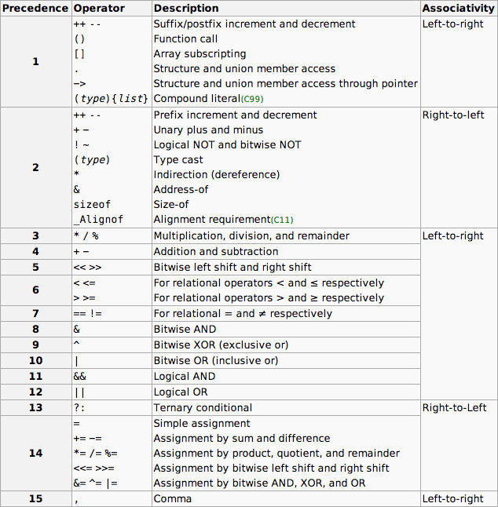

# Типове данни, константи, оператори, кастване, изход

## Функция printf()
### Първа програма на C:
```c
#include <stdio.h>
int main() 
{
    printf("Hello, World!\n");
    return 0;
}
```

## Коментари (Keyboard shortcut: Ctrl + /)

### Единичен ред
```c
// Коментар
```

### Множество редове
```c
/*
Коментар
*/
```

**Алтернативно**
```c
/**
 * Коментар
 * -> VSCode автоматично ще слага звездичките
 */
```

## Типове 
| **Тип** | **Големина (байтове)** | **Диапазон** |
|----|----|----|
| **bool** | **1** | **True или False** |
| **char** | **1** | **-128 до 127 или 0 до 255** |
| **short** | **2** | **-32,768 до 32,767** |
| **int** | **4** | **-2.15 x 10^9 до 2.15 x 10^9** |
| **long** | **4** | **-2.15 x 10^9 до 2.15 x 10^9** |
| **long long** | **8** | **-9.22 x 10^18 до 9.22 x 10^18** |
| **float** | **4** | **1.2 x 10^-38 до 3.4 x 10^38** |
| **double** | **8** | **2.3 x 10^-308 до 1.7 x 10^308** |
| **long double** | **12** | **3.4 x 10^-4932 до 1.1 x 10^4932** |

***За типа `bool` се използва библиотеката `<stdbool.h>`.***

***`unsigned` - само положителни стойности. Диапазонът на променливата остава същият, но се премества от 0 до 2^n-1.***

### Пример за деклариране и инициализация на променливи:
```c
#include <stdio.h>

int main() 
{
    int a = 5, b = 10, c; // c = 0 по подразбиране от компилатора
    c = 1;
    printf("a = %d b = %d c = %d\n", a, b, c);
    return 0;
}
```

## Константи

**За да декларираме константа, използваме ключовата дума `const` пред типа на променливата.**

```c
const int a = 5; // OK
a = 6; // Грешка
```

## Кастване/преобразуване на типове

### Имплицитно кастване
```c
// Без загуба на точност
int a = 5;
double b = a;

// Със загуба на точност
double c = 5.5;
int d = c;
```

### Експлицитно кастване
```c
double a = 5.5;
int b = (int)a;
```

## Форматиращи спецификатори в printf()

| **Спецификатор** | **Тип** |
|----|----|
| **%d** | **int** |
| **%ld** | **long** |
| **%lld** | **long long** |
| **%c** | **char** |
| **%f** | **float** |
| **%lf** | **double** |
| **%s** | **char[]** |
| **%p** | **pointer** |
| **%x** | **hexadecimal** |
| **%o** | **octal** |

### Синтаксис:
```
%[флагове][ширина][.точност][размер]спецификатор
```

Подробно обяснение може да намерите [тук](https://www.w3schools.com/c/ref_stdio_printf.php)

### Пример:
```c
#include <stdio.h>
int main() 
{
    double a = 3.14159;
    printf("a = %.3f\n", a);
    return 0;
}
```
**Изход:**
```
a = 3.142
```

## Оператор sizeof
```c
#include <stdio.h>
int main() 
{
    printf("Size of int: %d\n", sizeof(int));
    return 0;
}
```
**Изход:**
```
Size of int: 4
```

## Оператори
* **Арифметични оператори**: `+`, `-`, `*`, `/`, `%`
* **Оператори за сравнение**: `==`, `!=`, `>`, `<`, `>=`, `<=`
* **Оператори за присвояване**: `=`, `+=`, `-=`, `*=`, `/=`, `%=`
* **Логически оператори**: `&&`, `||`, `!`

### Приоритет на операторите и асоциативност на операторите:


### Позиция на операторите:
* **Префиксен**: `++a`, `--a`, `!a`, `+a`, `-a`
* **Инфиксен**: `a + b`, `a - b`, `a * b`, `a / b`, `a % b`
* **Постфиксен**: `a++`, `a--`

## Задачи

### Задача 1: 
Напишете програма, която отпечатва името и факултетния ви номер. Задайте си предварително променлива за факултетния номер.

### Задача 2: 
Напишете програма, която извежда големината на всички типове данни.

### Задача 3: 
Напишете програма, която извежда трицифрено число наобратно.

Пример:
```c
int main()
{
    int n = 123;
    // Изход: 321
}
```

### Задача 4: 
Напишете програма, която разменя стойностите на две числа.
 - Бонус: Без да използвате трета променлива.

### Задача 5: 
Напишете програма, извежда резултата от делението на две цели числа. Резултатът трябва да бъде закръглен до пети знак след десетичната запетая. Нека изходът има водеща нула.

### Задача 6:
Напишете програма, която извежда минималната и максимална стойност на всички типове данни. За целта са необходими библиотеките `<limits.h>` и `<float.h>`. Стойностите са именувани като: `CHAR_MIN`, `CHAR_MAX`, `SHRT_MIN`, `SHRT_MAX`, `INT_MIN`, `INT_MAX`, `LONG_MIN`, `LONG_MAX`, `LLONG_MIN`, `LLONG_MAX`, `FLT_MIN`, `FLT_MAX`, `DBL_MIN`, `DBL_MAX`, `LDBL_MIN`, `LDBL_MAX`.