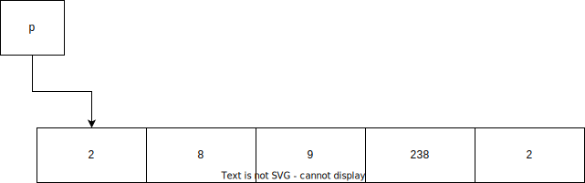

# Указатели и динамична памет

## Указатели

- Указателите са променливи, които съдържат адрес в паметта на друга променлива.
- Голеемината на указателите зависи от операционната система (32/64 битова - съответно 4/8 байта).

```c
int x = 10;
int *ptr; // Декларация на указател
ptr = &x; // Присвояване на адреса на x на указателя
int *p, *q; // Декларация на няколко указателя
int *null = NULL; // Инициализация на указател с неутрална стойност
```

## Оператори за работа с указатели

- `&` - връща адреса на променлива
- `*` - връща стойността на променлива

### Работа с указатели

```c
int arr[] = {2, 8, 9, 238, 2};
int *p = arr; // p сочи към първия елемент на масива
```



```c
printf("%p\n", p); // Адрес на първия елемент
int **pointer_address = &p 
printf("%p\n", pointer_address); // Адрес на указателя
```

```c
printf("%d\n", *p); // 2
```

```c
printf("%d\n", *(p + 1)); // 8
```

```c
p++; // Преместваме указателя към следващия елемент
printf("%d\n", *p); // 8
```


## Разположение на памет в C програма


### Stack
Паметта се заделя по време на компилация и се освобождава автоматично при излизане от scope-а, в който е дефинирана.

### Heap
Паметта се заделя по време на изпълнение на програмата. От тук се заделя памет без предварително да е известна големината. Паметта продължава да е "заета" дори и след излизане от областта на видимост.

## Функции за работа с динамична памет

- `malloc(<size>)` - заделя памет в heap с размер `<size>` байта
- `calloc(<num>, <size>)` - заделя памет за `<num>` елемента с размер `<size>` байта
- `realloc(<ptr>, <new_size>)` - преоразмерява блока на памет, сочен от `<ptr>`, на нов размер `<new_size>` байта
- `free(<ptr>)` - освобождава паметта, която е била заделена с `malloc`, `calloc` или `realloc`

```c
// Определяне на големина на масив по време на изпълнение
int n;
scanf("%d", &n);
int *arr = (int*)malloc(n * sizeof(int)); // Използваме (int*) защото malloc връща void* и трябва да преобразуваме към подходящия тип

// Освобождаване на памет
free(arr);
```

```c
// Работа със calloc
int *arr = (int*)calloc(5, sizeof(int)); // Заделяме памет за 5 елемента
free(arr); 
```

```c
// Работа с realloc
int *arr = (int*)malloc(5 * sizeof(int)); // Заделяме памет за 5 елемента
arr = (int*)realloc(arr, 10 * sizeof(int)); // Преоразмеряваме масива до 10 елемента
free(arr);
```

**Важно** Възможно е паметта да не се задели успешно от heap-а. Функцията ще се опита да освободи памет, но в краен случай ще върне `NULL` и ще дигне `errno` (дефинира се в `<errno.h>`, повече за него можете да прочетете [тук](https://en.cppreference.com/w/c/error/errno)). 

<br> В такъв случай винаги проверяваме дали паметта е заделена успешно:

```c
int new_int = (int*)malloc(sizeof(int));

if (new_int == NULL) // Някои хора биха предпочели NULL == new_int, не че има значение
{
    puts("Memory allocation error!\n");
    new_int = NULL; // Добра практика е да зануляваме указатели ако няма да ги ползваме повече
}
```

## Функция, която връща масив, заделен динамично

```c
int* createArray(const unsigned count) {
    int *array = (int*)malloc(count*sizeof(int));

    if (array == NULL)
    {
        prinf("Error allocating memory\n");
        return NULL;
    }

    return array;
}
```

## Функция, която връща двумерен масив, заделен динамично

```c
int** createMatrix(const unsigned rows, const unsigned cols) {
    int **matrix = (int**)malloc(rows*sizeof(int*));

    if (matrix == NULL)
    {
        prinf("Error allocating memory\n");
        return NULL;
    }

    for (int i = 0; i < rows; i++)
    {
        matrix[i] = (int*)malloc(cols*sizeof(int));
        if (matrix[i] == NULL)
        {
            prinf("Error allocating memory\n");
            return NULL;
        }
    }

    return matrix;
}
```

## Задачи

**Задача 1** Да се напише програма, която при въведен масив от n цели числа да намира кой от всички елементи преобладава. Ако има еднакъв брой преобладаващи числа да се извади първото срещнато.

*Вход: n = 7, array = [2, 2, 1, 1, 1, 2, 2]*</br>
*Изход: 2*

*Вход: n = 3, array = [3, 2, 3]*</br>
*Изход: 3*

**Задача 2** Да се напише програма, която при въведени масив от n цели числа и ги сортира в нарастващ ред спрямо броя на включените им битове. Ако има 2 числа с еднакъв брой включени битове да се подредят в нарастващ ред.

*Вход: n = 9, array = [0 1 2 3 4 5 6 7 8]*</br>
*Изход: 0 1 2 4 8 3 5 6 7*

Обяснение:</br>
[0] - 0 включени бита.</br>
[1,2,4,8] - 1 включен бит.</br>
[3,5,6] - 2 включени бита.</br>
[7] - 3 включени бита.

*Вход: n = 10, array = [1024 512 256 128 64 32 16 8 4 2 1]*</br>
*Изход: 1 2 4 8 16 32 64 128 256 512 1024*

**Задача 3** Напишете функция, която при подаден масив с дължина n и n цели числа, намира най-малкият ***среден индекс***. Ако не съществува ***среден индекс***, който да удовлетворява условията върнете -1. ***Среден индекс*** е индекс, за който е в сила следните зависимости:

- nums[0] + nums[1] + ... + nums[middleIndex - 1] == nums[middleIndex + 1] + nums[middleIndex + 2] + ... + nums[n - 1]
- Ако ***средният индекс*** е 0, то лявата сума се счита за 0.
- Ако ***средният индекс*** е n - 1, то дясната сума се счита за 0.

*Вход: n = 5, nums = [2 3 -1 8 4]*</br>
*Изход: 3*

*Вход: n = 3, nums = [1 -1 4]*</br>
*Изход: 2*

*Вход: n = 2, nums = [2 5]*</br>
*Изход: -1*

**Задача 4** Да се напише функция, която приема n x m матрица от цели положителни числа acoounts, където accounts[i][j] е сумата, която i-тия човек държи, в банка j. Функцията да връща кой е най-богатият човек. Състоянието на един човек се определя от сбора на сумите, които той държи във всички банки.

*Вход: n = 2, m = 3, accounts = [[1 2 3], [3 2 1]]*</br>
*Изход: 6*

*Вход: n = 3, m = 2, accounts = [[1 5], [7 3], [3 5]]*</br>
*Изход: 10*

*Вход: n = 3, m = 3, accounts = [[2 8 7], [7 1 3], [1 9 5]]*</br>
*Изход: 17*

**Задача 5** Да се напише функция, която при подаден масив с дължина 2*n, намира дали масивът може да се раздели на n двойки, за които са изпълнени следните условия:

- Всеки елемент от масива може да участва само в една двойка.
- Числата във всяка двойка да са равни.

Функцията да връща true ако такова разпределение е възможно и false в противен случай.

*Вход: n = 6, array = [3 2 3 2 2 2]*</br>
*Изход: true*

*Вход: n = 4, array = [1 2 3 4]*</br>
*Изход: true*

**Задача 6** Да се напише функция, която при подаден масив от n цели числа, връща нов масив от вида: answer[i] = |leftSum[i] - rightSum[i]|.

- Размерът на answer е същият като на оригиналният масив.
- leftSum[i] е сумата на числата в интервала [0, i). Ако i = 0, считаме сумата за 0.
- rightSum[i] е сумата на числата в интервала (i, n - 1]. Ако i = n - 1, считаме сумата за 0.

*Вход: n = 4, array = [10 4 8 3]*</br>
*Изход: [15 1 11 22]*

*Вход: n = 1, array = [1]*</br>
*Изход: [0]*

**Задача 7** Напишете функция, която при подаден масив от цели числа с дължина n и цяло число k, което е елемент от масива, да пренареди елементите в масива, така че всички по-малки елемнти от k да са отляво на k, а всички по-големи да са отдясно на него.

*Вход: 9 [1 5 6 3 0 -1 2 9 7] 3*</br>
*Изход: [1 0 -1 2 3 6 5 9 7]*