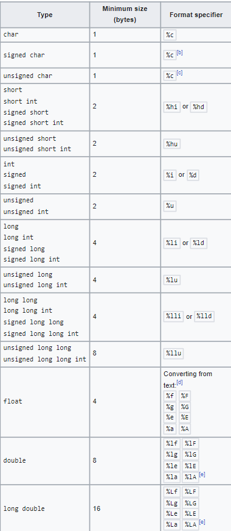

# Интегрирана среда за обработка IDE

- Редактор на код, подчертаване, автоматично попълване, форматиране
- Дебъгер
- Visual Studio, VSCode, Code::Blocks, CLion

**Блок за компилиране на вашия код**
```bash
gcc main.c -o main -Wall -pedantic
./main.exe
```
# Компилатор

- "Превежда" нашият код на по-ниско ниво (машинен език или асемблен)
- Създава изпълним .exe файл
- GCC, Clang, MSVC...

# Четене и извеждане на конзолата

```c
#include <stdio.h>
int main()
{
    int inputNum;
    printf("Think of a number: ");
    scanf("%d", &inputNum);
    printf("Your number is: %d\n", inputNum);
    return 0;
}
```

# Коментари

```c
//Това е коментар
printf("Hello world\n")
/*
Това е коментар
на няколко реда
*/
```

# Основни типове данни в C:

- За размера на някои типове данни зависи дали използваме 32 или 64 бита.



- ASCII таблицата - <https://www.asciitable.com//>

# Променливи и константи

- Декларация, инициализация, дефиниция

```c
int myNum; // декларация
myNum = 5; // инициализация
// декларация + инициализация = дефиниция
// декларацията заделя памет за променливата
```

- конвенции за именуване на променливи:

```c
int myNum //camelCase
int MyNum //PascalCase
int my_num //snake_case
```


## Какво ще изведе програмата

```c
int a = 5;
printf("%d\n", a++);
printf("%d\n", ++a);
//Постфиксен и префиксен???
```

# Задачки за седмица 1

## Задачи въведение - типове данни и оператори

1. Да се покаже последната цифра на дадено число.

Пример 1 за числото 123
   ```
    Last digit: 3
   ```
   
Пример 2 за числото 45678
   ```
    Last digit: 8
   ```
3. Имаме две цели числа. Да се изведът всички познати алгебирчни операции над тях.

   Пример, числата 123 и 456
   ```
    Sum of numbers: 579
    Difference of numbers: -333
    Multiplication of numbers: 56088
    Division of numbers: 0.26...
   ```
5. Имаме кординати на двуизмерна точка, да се намир разтоянието и от (0,0) на втора степен

   Пример за (1, 1)
    ```
    Length: 2
    ```
   Пример за (2, 3)
    ```
    Length: 13
    ```
7. Имаме дробно число, да се изведе цялата му част.

   Пример за 10.4
   ```
   Out: 10
   ```
   Пример за 11
   ```
   Out: 11
   ```
   Пример за 3.9
   ```
   Out: 3
   ```
9. По подадена малка буква, да се изведе съответстващата и главна буква.
    Пример за 'а'
    ```
    Out: А
    ```
    Пример за 'z'
    ```
    Out: Z
    ```
11. Имаме коефициенти на квадратно уравнение, да му се изведът корените.
    Пример за 1 -2 1
    ```
    Out: 1 1
    ```
    Пример за 3 2 -8
    ```
    Out: -2 1.3333
    ```
13. Имаме четрицифрено число, да се изведе сумата от цифрите му.
    Пример за 1234.
    ```
    Out: 10
    ```
    Пример за 123.
    ```
    Out: 6
    ```
    Пример за 55.
    ```
    Out: 10
    ```
