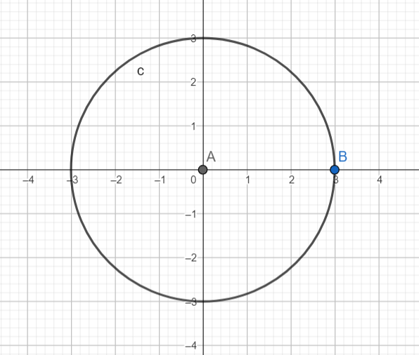

# Седмица №2

## Scanf

scanf, като функция е доста подобна на printf по параметри. Scanf приема вход от конзолата.
Анализира входа според това което сме подали като първи параметър и пази резултата в параметрите, които сме подали след 1-вия.
Параметрите, които са след първия засега приемаме, че задължително преди себе си трябва да имат амперсант(&).

Символите, които се игнорират са шпации и табове.

```C
#include <stdio.h>

int main() {
    int a;
    scanf("%d", &a);
    printf("%d\n", a);

    int year, date, month;
    scanf("%d/%d/%d", &date, &month, &year);
    printf("%d %d %d", date, month, year);
    return 0;
}
```

## Условно изпълнение

### if

```C
#include <stdio.h>

int main() {
    // Write C code here
    int a = 4;
    if(a==3){
        printf("ABV\n");
    }else if (a == 4){
        printf("GDE\n");
    }else{
        printf("JZI\n");
    }
}
```

### ternary-operator

```C
#include <stdio.h>

int main() {
    int a = 4;
    printf((a==4)?"Az sum 4\n":"Az ne sum 4\n");
}
```

### switch

```C
#include <stdio.h>

int main(){
    char ab;
    scanf("%c", &ab);
    switch(ab){
        case 'a': printf("a");break;
        case '3': printf("easter egg = ");
        case '6': printf("42");break;
        default: printf("default path");
    }
    return 0;
}
```

### Short-circuit evaluation

```C
#include <stdio.h>

int main(){
    int orTest = 4;
    orTest || orTest++;
    printf("%d\n", orTest);
    orTest = 0;
    orTest || orTest++;
    printf("%d\n", orTest);
    int andTest = 4;
    andTest && andTest++;
    printf("%d\n", andTest);
    andTest = 0;
    andTest && andTest++;
    printf("%d\n", andTest);

    return 0;
}
```

### Задачи

1. Даден е символ, да се провери дали е буква, цифра или нещо друго.
2. Да се провери дали година е високосна.

```c
Input: 2024
```

```c
Output: true
```

```c
Input: 2077
```

```c
Output: false
```

3. Даден е месец с число (Януари-1,Февруари-2...). Да се изведе колко дни има месецът.
4. Фирма има X бюджет за заплати на служителите си. Приема се от конзолата бюджета и броя на служителите. Да се изведе дали бюджета е достатъчен, така че всеки служител да получава поне минимална заплата (933лв.) или фирмата трябва да прави съкращения(ако да, колко служителя трябва да съкрати).

5. Приема се точка от конзолата (x, y). Да се изведе дали е вътрешна за фигурата
   

6. Дадени са три точки (x1,y1),(x2,y2),(x3,y3). Да се изведе дали лежат на една права.

```c
Input: 0 0 5 1 -10 -2
```

```c
Output: 3 points on one line!
```

```c
Input: 0 0 5 1 -10 -1
```

```c
Output: Not on one line!
```

7. Камък, ножица, хартия - приемат се два играча от конзолата, възможните стойности са 'r', 'p', 's'(Бонус да е case-insensitive). Да се изведе кой е победителят. При невалиден вход да се изведе съобщение за грешка.

```c
Input: p S
```

```c
Output: Player2 is winner!
```

```C
Input: R r
```

```C
Output: Draw!
```
