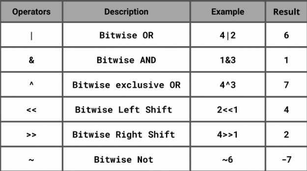
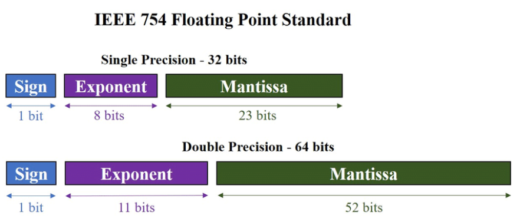

# Побитови операции



# Представяне на float и double



- От експонента зависи къде ще е "точката"
- Мантиса е самото число без "точката"
- Може както много големи както и много малки числа

## Quiz

```C
    int num, n;
    scanf("%d", &num);
    printf("Enter the bit position to set: ");
    scanf("%d", &n);
    num |= (1 << n);
    printf("The new number is: %d", num);
    return 0;
```

- а обратното?

```c
    int num1, num2;
    scanf("%d", &num1);
    scanf("%d", &num2);
    printf("The new number is: %d", (num1 ^ num2) >= 0);
```

## Задачи
### Задача 1: Супергеройски сили
Искаме да напишем програма, която може да пази характеристики за различни супер герои. 
Имаме следните характеристики:
1. Магии
2. Супер сила
3. Супер скорост
4. Телепатия
5. Телепортация
6. Манипулация на времето
7. Супер продуктивност
8. Омнипотентност

Потребителя въвежда число за даден супергерой(Иван) и според това дали съответия бит е 1 дадената характеристика е притежавана от супергероя Иван.

**1.1** Трябва всички характеристики които са истина да бъдат изпринтирани

Примери:

```
Характеристики: 3
Магии
Супер сила
```

```
Характеристики: 253
Магии
Супер скорост
Телепатия
Телепортация
Манипулация на времето
Супер продуктивност
Омнипотентност
```

**1.2** Нашата система обаче засега работи само с базовите супер сили, не можем да вкараме специални комбинации

Затова въвеждаме следните комбинации, които се добавят към досега принтираните стойности

Телепортация + Манипулация на времето = Върховния скитник

Магии + Телепатия = Мистичен ум

Телепортация + Телепатия, но без Манипулация на времето = Групов мозък

Примери:

```
Характеристики: 97
Магии
Телепортация
Манипулация на времето
*Върховния скитник*
```

```
Характеристики: 255
Магии
Супер сила
Супер скорост
Телепатия
Телепортация
Манипулация на времето
Супер продуктивност
Омнипотентност
*Върховния скитник*
*Мистичен ум*
```

### Задача 2: Battleships
Имаме поле, което е съставено от 16 квадратчета, разположени в 4 колони и 4 редове, като всяко квадратче съдържа в себе си или 0, или 1.

В началото на играта, полето съдържа само 0ли

Първия играч въвежда локацията, като въвежда кординати x и y, които трябва да бъдат валидирани дали са подходящи. На този индекс в полето трябва да бъде поставена единициа

След това втория потребител се пробва да познае в кое квадратче е 1цата има 3 опита.

**не може да ползвате масиви или цикли**

Примери:

```
Потребител 1: 1 1
Потребител 2: 2 2
Грешно
Потребител 2: 1 2
Грешно
Потребител 2: 1 1
Вярно
Потребител 2 печели
```

```
Потребител 1: 1 1
Потребител 2: 2 2
Грешно
Потребител 2: 1 2
Грешно
Потребител 2: 0 2
Грешно
Потребител 1 печели
```

### Задача 3: Решаване на лабиринт
Имате като променлива някакво 16 битово число, което ви отговаря за лабиринт. Нека това число е 1634.
Потребителя трябва да стигне от най горния ляв ъгъл до най-долния десен ъгъл.
Потребителя има 7 движения преди да стигне до финалната дестинация. Като имате следните възможности за движения

- Нагоре = 'u'
- Надолу = 'd'
- Наляво = 'l'
- Надясно = 'r'

Примери:
```
Движение: l
Движение: l
Движение: l
Движение: d
Движение: d
Движение: d
Вие достигнахте целта си.
```

```
Движение: l
Движение: l
Движение: l
Движение: d
Движение: d
Движение: u
Кислородът ти свърши
```

### Задача 4: Дешифратор на числа с плаваща запетая

Потребителя въвежда число с плаваща запетая и трябва на екрана да му се изведе знака на това число и експонентата, която е ползвана за да бъде сметнато. Нека да записваме числата с плаваща запетая в стойности от тип double

Примери:
```
Number: 3.14
Sign: 0
Exponent: 128
```
```
Number: -3.14
Sign: -1
Exponent: 128
```

