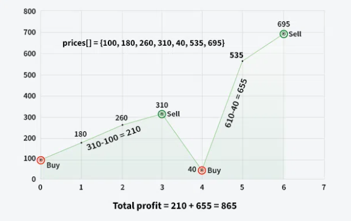

## Задачи

1. Да се напише функция switchOddAndEvenIndexes({масив от интове}, {големина}), която разменя елементите на четен индекс с тези на нечетен.

```c
IN: {1, 2, 3, 4, 5, 6, 7, 8}
OUT:
{2, 1, 4, 3, 6, 5, 8, 7}
```

2. Даден е масив от 0 и 1. Намерете дължината на най-дългата поредица от 1-ци.
```c
IN: [1, 1, 0, 1, 1, 1]
OUT: 3
```

2. Да се напише функция bool isSorted({масив от интове}, {големина}), която връща дали масив е сортиран(да работи и за нарастващ и намаляващ), без два цикъла.

3. Да се напише функция, която изкарва всички възможни ротации на масив от символи

```c
IN: {a, b, c, d, e}
OUT:
abcde
bcdea
cdeab
deabc
eabcd
```

4. Даден е масив от цели числа. Да се напише функция, която премества отрицателните числа в края на масива и ги сортира в низходящ ред и запазва реда на положителните.

```c
IN: {5,-7,21,3,6,-3,-12,-1,53}
OUT: {5, 21, 3, 6, 53, -1, -3, -7, -12}
```

5. Да се напише функция, която сортира масив само на четните индекси и оставя нечетните на място

```c
IN:{9, 8, 7, 6, 5, 4, 3, 2, 1, 0}
OUT: {1, 8, 3, 6, 5, 4, 7, 2, 9, 0}
```

6. Фирма на "Wallstreet" иска невероятните умения на някой програмист от висока класа да изчисли колко е могла да спечели за минал период от време.
   Напишете функция която от даден масив от цени на акцията по дни, изчислява най-големия възможен приход.
   

```c
IN: {100, 180, 260, 310, 40, 535, 695}
OUT: 865
```

7. Даден е масив от числа. Да се върне максималната сума от index \* array[index] като са позволени единствено ротации на масива.
